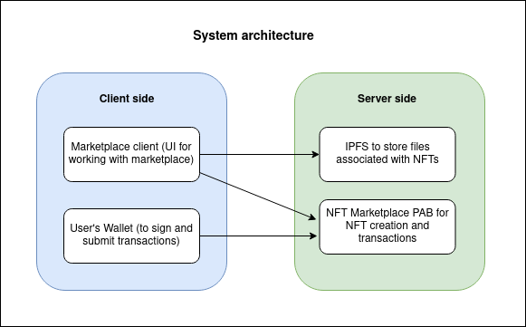
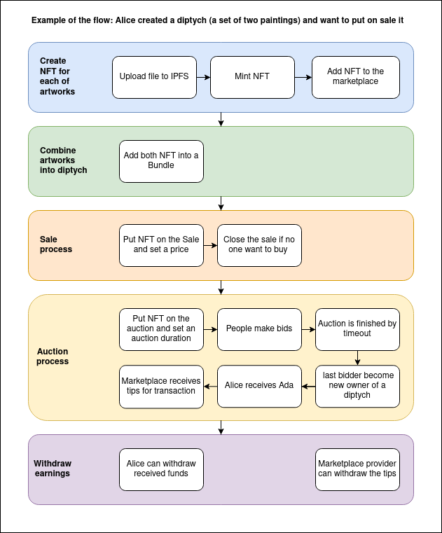

# NFT Marketplace

## Brief description

NFT Marketplace Service enables to create NFT tokens for any file and put them on sale or auction. Marketplace allows combining NFT tokens into bundles and operate them as a single unit when sell or buy it.

## Monetization

The marketplace operator receives a fee from:

- Fixed fee by NFT minting
- Fixed fee by NFTs bundling
- Percentage by NFT price on the Sale
- Percentage by final bid on the Auction

## Glossary

**Bundle** - a collection of tokens provided as a single unit.

**Sale** - a protocol when NFT owner sets a fix price for NFT and opens sale for NFT buyers. NFT seller can close the sale if NFT isn't bought at that moment. It works for bundles as well.

**Auction** - a protocol when NFT owner puts up an NFT for auction by 0 Ada and sets a timeout of auction's duration. NFT bidders can bid their price before the timeout. The winner is the bidder who made a last bid. If there are no bids on timeout, NFT returns to its seller. It works for bundles as well.

**Marketplace tips** - a marketplace provider profits by carrying auctions and sales.

## Users categories

**Marketplace provider** - an actor who started a marketplace smart contract

**NFT owner** - an actor who owns NFT token

**NFT seller** - an NFT owner who put his NFT up to the sale or auction

**NFT buyer/NFT bidder** - an actor who tries to buy an NFT on the Sale/make a bid on the auction

## System architecture

## Example of the flow

## Features list

### Marketplace owner API

`start()` - Start marketplace smart contract.

### Marketplace user

`createNft()` - Mint NFT token and add it to the marketplace.

`addNft()` - Add NFT from another marketplace that uses the same minting protocol ([IPFS content id as a token name](#implementation-features)).

`openSale()` - Puts NFT on sale.

`buyItem()` - Buy NFT.

`closeSale()` - Close sale and receive token back.

`startAnAuction()` - Start an auction for specified NFT.

`completeAnAuction()` - Complete auction before the timeout.

`bundleUp()` - Create a bundle from specified NFTs.

`unbundle()` - Unbundle specified NFTs.

`ownPubKey()` - Get `pubKeyHash` for public key belonging to the wallet of a marketplace provider.

`ownPubKeyBalance()` - Get balance on marketplace provider address.

### Marketplace info

`fundsAt()` - Get all UTxOs belonging to a user.

`marketplaceFunds()` - Get all UTxOs belonging to the Marketplace.

`marketplaceStore()` - Get current marketplace store state.

`getAuctionState()` - Get current auction state for specified NFT

## Implementation details

The main features are related to uploading a file and minting NFT. 

- **Uniqueness of an uploaded file:** Using IPFS - [Content-addressable Storage](https://en.wikipedia.org/wiki/Content-addressable_storage) to store uploading files, that guarantee the uniqueness of a linked file. `IPFS content id (cId)` link is used to link the NFT with file in a storage.

- **Availability of cId:** `CId` is available in NFT owner's wallet - it is used as a token name. Using a `cId` as a token name is a requirement for this marketplace implementation. NFT can be imported from another marketplace, only if that requirement was abided.

- **Privacy of cId link:** Using `cId` hash for the token name in on-chain code, to hide the NFT token until NFT owner decide to make it public putting it up on the sale or auction.
