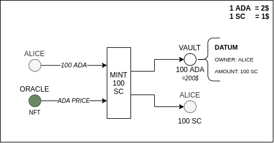
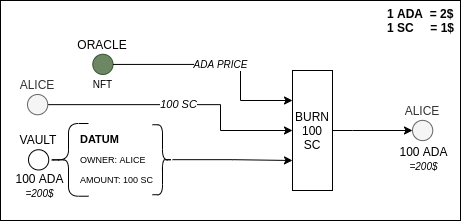
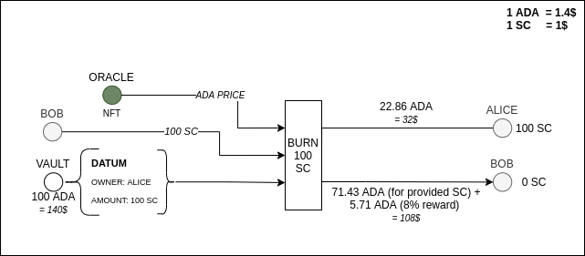

# Node Factory - Crypto backed stable coin on Cardano

### Introduction

The idea of this use case is to create a stable coin pegged to the US dollar within the Plutus partnership program. In this case, the stable coin is backed by the over-collateralization of ADA. For example, if a user wants to mint 100$ worth of stable coin he/she will need to lock at least 150% of the issued value as ADA (the price of ADA is provided from the oracle at the moment of minting the stable coin).
## Setting up

- Install [nix](https://nixos.org/download.html)
- Clone and setup [plutus repo](https://github.com/input-output-hk/plutus) following README instructions (pay attention on setting binary cache)

## Starting example

1. Start `nix-shell`
 
*Make sure that plutus is set up - and run nix-shell inside cloned Plutus repo*

1. Build the PAB executable:

```
cabal build plutus-starter-pab
```

2. Run the PAB binary:

```
cabal run plutus-starter-pab
````

This will then start up the server on port 8080. The devcontainer process will then automatically expose this port so that you can connect to it from any terminal (it doesn't have to be a terminal running in the devcontainer).

## Documentation

### Opening a vault (minting stable coin)

If a user wants to mint new stable coins, he/she needs to open a new “vault”. This vault will hold ADA collateral that must be at least 150% of minted stable coin value at the moment of minting. In practical use cases, users will always want to lock more than 150% of value in collateral as this is the threshold for liquidation (if the collateral value falls under 150% of the value it is eligible for liquidation). The current value of ADA on the market will be provided through an oracle.

Based on the price of ADA (PADA) and the amount of stable coins that the user wants to mint     (ASC), the user will need to send at least a minimal amount of ADA (Amin) to open the vault.

Collateral will be sent to the created vault’s script address, which will also record information on the sender and the size of the collateral. This will be used as input on closing or liquidating the vault.

Let’s say that Alice wants to mint 100 stable coins (SC) and she has decided to lock 200% of the minted value as collateral. As the current price of 1 ADA is 2$, she will send 100 ADA when opening the vault and receive 100 SC. This process is represented in the following schema.


### Closing a vault (burning the stable coin)

When  Alice wants to close her opened vault and return the collateral, closing action must be invoked. Here Alice sends the same amount of stable coin that was originally minted together with the vault UTXO - vault is closed and the user receives original collateral back. It is important to note that this action is possible only if the liquidation criteria haven’t been met. This process is represented in the following schema.



### Vault liquidation

Liquidation is an action that can be executed only if the current value of vault collateral has fallen below the defined 150% value of the minted stable coin. In this case, anybody is eligible to execute the liquidation process if he/she has enough stable coins to close the vault.

We will continue with our example where Alice minted 100 SC for 100 ADA when the price of 1 ADA was 2$, and the collateral value was 200% of the minted stable coin value.

Currently, the price of one ADA is 1.4$, and the value of the collateral is 140% of the minted stable coin value. This makes Alice’s vault eligible for liquidation. Bob decides that he has some spare stable coin and wants to liquidate Alice’s vault as he is incentivized by the reward for doing that. He will send the same amount of stable coin that Alice originally minted to close the vault. Locked ADA collateral is firstly used to pay out Bob for providing stable coins needed to close the vault. As an incentive for executing liquidation Bob will get 8% (an arbitrary parameter defined by the protocol) more value back. In the example below, as Bob provided 100 SC having a value of 100$, he will get 77.14 ADA back that at the moment of liquidation has a value of 108$. In total, Bob has earned 8$ in total for providing 100$ worth of stable coins (8%). The rest of the collateral that’s remaining will be returned to Alice.


