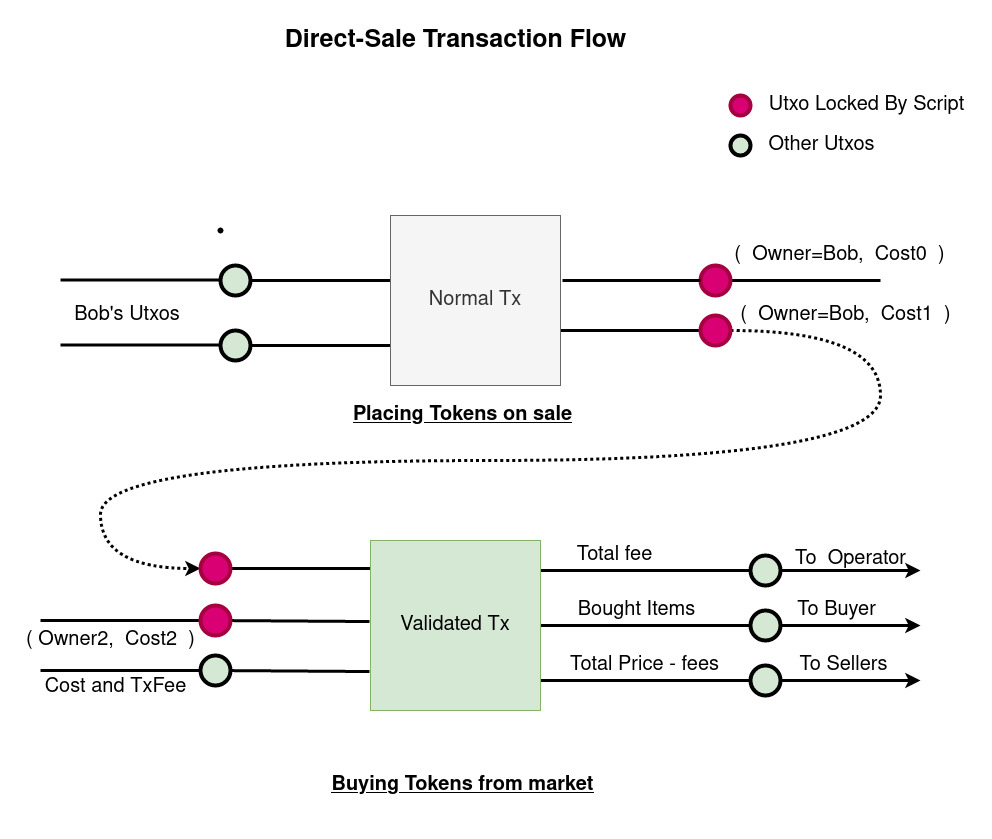
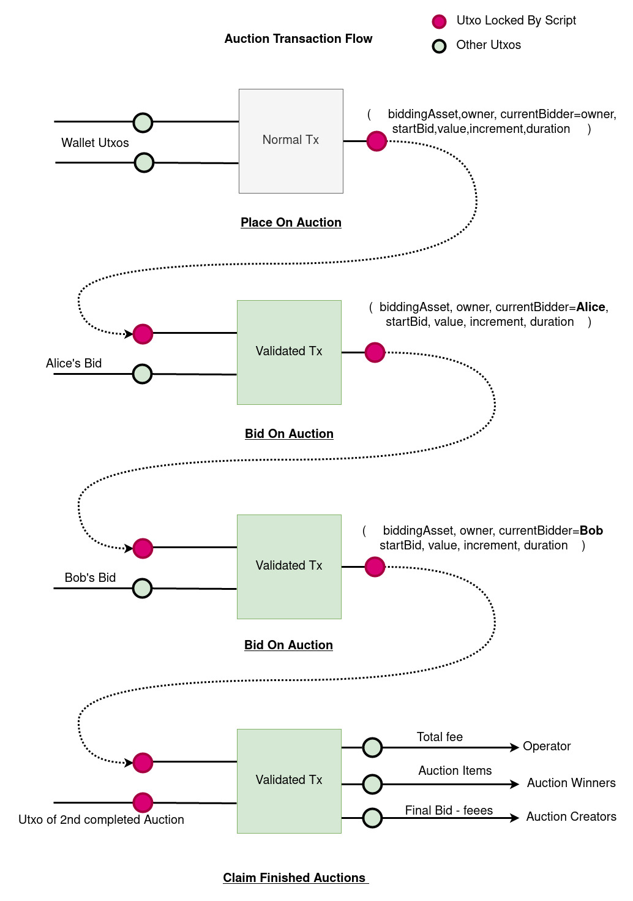

Plutus Tokens MarketPlace
=========================

A famous website sets up a marketplace in Cardano Blockchain.
You can mint a new nft or bring your tokens to the Market.  The tokens can be place either for sale or Auction.

The Items you place on sale or auction will be listed on their website. So, for each sale, they will charge you some fee.

## Setting up

- Assume that we are in directory /home/user, clone this project to directory `/home/user/plutus-use-cases`
- Install Nix [Instructions](https://nixos.org/download.html)
- Create either `/etc/nix/nix.conf` or `~/.config/nix/nix.conf` with following content

```
substituters        = https://hydra.iohk.io https://iohk.cachix.org https://cache.nixos.org/
trusted-public-keys = hydra.iohk.io:f/Ea+s+dFdN+3Y/G+FDgSq+a5NEWhJGzdjvKNGv0/EQ= iohk.cachix.org-1:DpRUyj7h7V830dp/i6Nti+NEO2/nhblbov/8MW7Rqoo= cache.nixos.org-1:6NCHdD59X431o0gWypbMrAURkbJ16ZPMQFGspcDShjY=
```

- Clone https://github.com/input-output-hk/plutus to `/home/user/plutus`
- cd to /home/user/plutus and Checkout `plutus-starter-devcontainer/v1.0.6` tag
- On the Plutus repository root, issue `nix-shell` command
- Inside the nix shell, `cd` to `/home/user/plutus-use-cases/dquadrant/nft`
- create a link for hpc. It's required for tests and might be different folder for other architectures. `ln - s ./dist-newstyle/build/x86_64-linux/ghc-8.10.4.20210212/plutus-tokens-0.1.0.0/hpc/vanilla/mix/plutus-tokens-0.1.0.0 ./hpc"
  `
##### Running Tests
 `cabal test plutus-tokens:test:tokens-test`

##### Starting PAB server
 ` rm -rf ./*.tix && cabal run tokens-pab`

Pab server will be available  available on http://localhost:8080 .

In the PAB server simulation,
- Wallet 10 is operator of the market
- Wallet 1-5 have active endpoints to interact with them.

During the simulation at anytime, you can give `\n` (NewLine or Enter) key input to the pab-server to see Funds of wallets.
It will list all the wallets and balances in them.

#### Starting the client
You can interact with the pab server either using api endpoints or with webapp.
Webap project Instructions for starting webapp is in [subfolder ./client/README.md](./client/README.md)

## Using the PAB server endpoints

Wallet instances in the pab-server can be listed with a get request

```http request
GET http://localhost:8080/api/new/contract/instances
```

Once you have the instance ID, you can call pab endpoints for the wallet instance.
after each endpoint call, to receive the response, you will have to issue a get request.
The response in the last item of `cicCurrentState.observabaleState` list in the json response

```http request
GET http://localhost:8080/api/new/contract/instance/{{instance_id}}/status
```

You can send `Enter` key input to the pab process to list the funds in console.
Each instance also has utility endpoint `funds` to list funds in wallet.

```http request
GET http://localhost:8080/api/new/contract/instance/{{instance_id}}/funds
```

**NOTE**: The endpoints that create transactions will return immediately, but the transaction won't be confirmed yet. You can poll the `status` endpoint and find out when it gets confirmed from the `observableState`.

### Minting NFT
NFT can be minted by calling ` mint` endpoint on the instance id. The token name must be hex encoded.

```http request
GET http://localhost:8080/api/new/contract/instance/{{instance_id}}/mint
Content-Type: application/json

{{ token_name_hex }}
```

### DirectSale
Direct Sale is created by submitting a utxo to scriptAddress with Datum containing `DirectSale` Datum.
Anyone can then claim the utxos by paying enough to the seller and fees to operator.



#### Place for sale
Requires list of Objects. Each object has `spItems`, the list of tokens to be sold,
`spSaleType` `Primary` if it's you created the NFT `Secondary` if you own the nft,
but you didn't create it.
```http request
POST http://localhost:8080/api/new/contract/instances/{{instance_id}}/sell
Content-Type: application/json

[{
  "spItems": [{
    currency: {{ policy_id }} ,
    token: {{ token_name_hex }} ,
    value: 1
  }],
  "spSaleType": "Primary",
  "spCost": {"currency": "", "token": "", "value": 100}
}]
```
#### List Items on Direct Sale.

Will return a list of items in sale, each items has an extra key : `reference` and it's value is the `TxOutRef` model.
You use the `reference` to buy it from market
```http request
POST http://localhost:8080/api/new/contract/instances/{{instance_id}}/list
Content-Type: application/json

  "lmUtxoType": "MtDirectSale",
}
```
#### Purchase  items
Purchase transaction can be made posting  list of `PurchaseParam` model to the endpoint.
each object in the list corresponds to a sale. In PurchaseRequestObject has `ppItems`: the list of tokens to be sold and `ppValue` : total cost of those items

```http request
POST http://localhost:8080/api/new/contract/instances/{{instance_id}}/buy
Content-Type: application/json

[{
   "ppItems": [ {{ utxo_ref_object }} ],
   "ppValue": {
            "currency": "",
            "token": "",
            "value": 200000
          }
}]
```

### Auction
The token or value to be placed for auction is sent to market script
with `Auction` Datum. The Datum contains auction's expiry, startBid ,increment and it's currentBidder


#### Place on Auction
List of Auction Items. The model contains `apValue` the value to be placed on auction `apMinBid`,
the starting bid , `apMinIncrement` minimum increment to be added to bid in each new bid, and other configurations. respectively as shown below
```http request
POST http://localhost:8080/api/new/contract/instances/{{instance_id}}/startAuction
Content-Type: application/json

[{
  "apValue": [{
    "currency": {{ policy_id }} ,
    "token": {{ token_name_hex }} ,
    "value": 1
  }],
  "apMinBid": {
    "currency": {{ policy_id }} ,
    "token": {{ token_name_hex }} ,
    "value": 2000000
  },
  "apMinIncrement": 1000000,
  "apStartTime": {"getPOSIXTime": 1596059091},
  "apEndTime": {"getPOSIXTime": 1596059091}
}]
```

#### List Items on Auction.

Will return a list of items in auction, each items has a key `reference` and it's value is the `TxOutRef` model.
You use the `reference` to bid it from market
```http request
POST http://localhost:8080/api/new/contract/instances/{{instance_id}}/list
Content-Type: application/json

{
  "lmUtxoType": "MtAuction",
}
```

### Bid On an Auction Item

Model contains `ref`, the `TxOutRef` model returned in the auction item when listing.
and `bidValue` list of tokens and it's value to place on bid.
Bidding is done only on the token having same policyId and tokenName as provided in createAuction endpoint.
Other values will be received by the auction creator as tips.
```http request
POST http://localhost:8080/api/new/contract/instances/{{instance_id}}/bid
Content-Type: application/json

{
  "ref": {{ utxo_ref_object }} ,
  "bidValue": [
    {
      "currency": {{ policy_id }} ,
      "token": {{ token_name_hex }} ,
      "value": 200000
    }
  ]
}
```
### Claim Auction
Once the Auction deadline is reached, auctions chan be claimed by the highest bidder
It required list of `TxOutRef` objects and when`ignoreUnClaimable` is set, Wallet code will ignore the utxos that can't be claimed and create transaction from claimable utxos.

```http request
POST http://localhost:8080/api/new/contract/instances/{{instance_id}}/bid
Content-Type: application/json

{
  "references":[ {{ utxo_ref_object }} ],
  "ignoreUnClaimable": true
}
```
