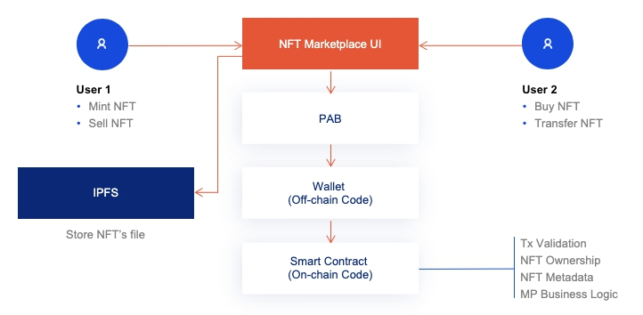

# NFT Marketplace.

The main idea of this prototype is to demonstrate the possibility of the business use case for NFT Marketplace, implemented with Plutus smart-contract language on the Cardano blockchain. 
On the high level, the DApp consists of the following components:​
- the Plutus part with implemented business logic and the marketplace metadata storage based on onchain/offchain smart contracts, and 
- the client Web UI part that allows users to interact with smart contracts to mint, sell, buy and transfer NTFs.

## Core functionality 
1. SignIn ability with one of the pre defined default wallets 
2. Mint a new NFT token and displaying it on the "My collection" page
3. Choose a certain NFT token from "My collection" page, set a price for it and put up for sale.
4. Use the marketplace Storefront page to view the list of all NFT tokens that are for sale
5. Cancel NFT token from sale
6. Buy a particular NFT token and view it on the "My collection" page
7. Transfer NFT tokens directly to other user wallet without Buy/Sell options

## Technology Stack
1. Plutus
2. Plutus Application Backend (PAB)
3. IPFS
4. ReactJS
 
## DApp Architecture
This prototype performs like a real-life decentralized application (DApp), all the core functionality features implemented as on-chain/off-chain code using Plutus capabilities. Thereby, the solution doesn't require any additional functionality and storage in the classic backend and databases manner.
DApp utilize IPFS network through third party provider(https://nft.storage/) for storing NFT's associated file.



### Start Contract
On a contract start we create single NFT market token used to uniqely identity marketplace.
Market token is stored in the script address and it is datum contains info of the all metadata tokens created in the marketplace to validate token uniqueness.

### Create NFT
On NFT token create we create two unique native tokens. One is the NFT token and it is send to the owner wallet.
Another one is the NFT metadata token. Metadata token is stored in the market script address and never leaves it. In the metadata token datum we store the Symbol of the NFT token and all metadata information (e.g. name, description, file). Market token utxo is consumed in the creation transaction, existing tokens list is taken from the market it is and used to verify new token uniqueness.


### Put token on sale
At any moment token owner can put token on sale, he transfers his NFT token to the marketplace and set token price. Only tokens created in the market could be put on sale.


### Buy token
If token is on sale, any user can buy it. Buyer receives the NFT token, Seller gets the price.


### Cancel selling
Token owner could decide to cancell sell. He will get the NFT token back from the market script. Token will be removed from the store.


### Transfer token
Owner could transfer token to any other user directly. Market NFT metadata tracks owner only when the token is on sale. If user have Market NFT token he can see put it on sale or see in the my market NFT token list.

## Setting up

Follow next steps to get an environment with the correct tools set up.

  - Run `nix-shell` command in the plutus folder
  - Run `cabal build all` from the nix-shell terminal

## The Plutus Application Backend (PAB) example

We have provided an example PAB application in `./pab`. With the PAB we can serve and interact
with contracts over a web API. You can read more about the PAB here: [PAB Architecture](https://github.com/input-output-hk/plutus/blob/master/plutus-pab/ARCHITECTURE.adoc).

Here, the PAB is configured with the `NFT` contract from `./src/Plutus/Contracts/NFT.hs`

Here's an example of running and interacting with this contract via the API. For this it will help if you
have `jq` installed.

1. Build the PAB executable:

```
cabal build simulator-nft-market-pab
```

2. Run the PAB binary:

```
cabal exec -- simulator-nft-market-pab
```

This will then start up the server on port 8080. The devcontainer process will then automatically expose this port so that you can connect to it from any terminal (it doesn't have to be a terminal running in the devcontainer).

1. Contract started in the server start script

2. Get the status

```
export INSTANCE_ID=...
curl -s http://localhost:8080/api/contract/instance/$INSTANCE_ID/status | jq
```

This has a lot of information; and in particular we can see what endpoints are still available
to call.

3. Start by creating NFT token, invoker will get NFT token in his Wallet.

Create token
```
export INSTANCE_ID=...
curl -H "Content-Type: application/json" \
  --request POST \
  --data '{"cpTokenName":"TestToken","cpDescription":"Test description","cpAuthor":"John Smith","cpFile":"https://ipfs.io/ipfs/bafybeieznanm2s27u2okty2xgorltsfoegtgvamovfjx56ctgijtz4caoy"}' \
  http://localhost:8080/api/contract/instance/$INSTANCE_ID/endpoint/create

#get response
curl -H "Content-Type: application/json" \
  --request GET \
  http://localhost:8080/api/contract/instance/$INSTANCE_ID/status | jq '.cicCurrentState.observableState'
```

4. Query my nft tokens.
```
export INSTANCE_ID=...
curl -H "Content-Type: application/json" \
  --request POST \
  --data '[]' \
  http://localhost:8080/api/contract/instance/$INSTANCE_ID/endpoint/userNftTokens

#get response
curl -H "Content-Type: application/json" \
  --request GET \
  http://localhost:8080/api/contract/instance/$INSTANCE_ID/status | jq '.cicCurrentState.observableState'
```

5. Put token on sell. You should be onwer of the spTokenName

```
export INSTANCE_ID=...
curl -H "Content-Type: application/json" \
  --request POST \
  --data '{"spSellPrice":1000,"spTokenName": "TestToken"}' \
  http://localhost:8080/api/contract/instance/$INSTANCE_ID/endpoint/sell

#get response
export INSTANCE_ID=...
curl -H "Content-Type: application/json" \
  --request GET \
  http://localhost:8080/api/contract/instance/$INSTANCE_ID/status | jq '.cicCurrentState.observableState'
```

6. Query all selling tokens. It get all selling tokens from all users
```
export INSTANCE_ID=...
curl -H "Content-Type: application/json" \
  --request POST \
  --data '[]' \
  http://localhost:8080/api/contract/instance/$INSTANCE_ID/endpoint/sellingTokens

#get response
curl -H "Content-Type: application/json" \
  --request GET \
  http://localhost:8080/api/contract/instance/$INSTANCE_ID/status | jq '.cicCurrentState.observableState'
```

7. Buy token.

```
export INSTANCE_ID=...
curl -H "Content-Type: application/json" \
  --request POST \
  --data '{"bpTokenName": "TestToken"}' \
  http://localhost:8080/api/contract/instance/$INSTANCE_ID/endpoint/buy

#get response
export INSTANCE_ID=...
curl -H "Content-Type: application/json" \
  --request GET \
  http://localhost:8080/api/contract/instance/$INSTANCE_ID/status | jq '.cicCurrentState.observableState'
```

8. Сancel token selling. You should have put token on sale to be able to retrieve it.

```
export INSTANCE_ID=...
curl -H "Content-Type: application/json" \
  --request POST \
  --data '{"cspTokenName": "TestToken"}' \
  http://localhost:8080/api/contract/instance/$INSTANCE_ID/endpoint/cancelSell

#get response
export INSTANCE_ID=...
curl -H "Content-Type: application/json" \
  --request GET \
  http://localhost:8080/api/contract/instance/$INSTANCE_ID/status | jq '.cicCurrentState.observableState'
```

9. Get user key. Get the invoker wallet public key hash

```
export INSTANCE_ID=...
curl -H "Content-Type: application/json" \
  --request POST \
  --data '[]' \
  http://localhost:8080/api/contract/instance/$INSTANCE_ID/endpoint/userPubKeyHash

#get response
export INSTANCE_ID=...
curl -H "Content-Type: application/json" \
  --request GET \
  http://localhost:8080/api/contract/instance/$INSTANCE_ID/status | jq '.cicCurrentState.observableState'
```

10. Transfer Token. If you own the token you can directly transfer it to the other user.

```
export INSTANCE_ID=...
curl -H "Content-Type: application/json" \
  --request POST \
  --data '{"tpTokenName": "TestToken", "tpReceiverWallet": 2}' \
  http://localhost:8080/api/contract/instance/$INSTANCE_ID/endpoint/transfer

#get response
export INSTANCE_ID=...
curl -H "Content-Type: application/json" \
  --request GET \
  http://localhost:8080/api/contract/instance/$INSTANCE_ID/status | jq '.cicCurrentState.observableState'
```

## Frontend App
To set up and configure the client side App follow next manual

[Run frontend](market-web-app/README.md)

## Unit tests
Run next command in the console of the root directory of the current project and see results on the screen
```
cabal test
```


## Testnet
1. Start pab
  If it's the first time your running, you'll need to ask the PAB to make the
  database:
  ```
  cabal exec -- testnet-oracle-pab --config pab-testnet/owner-config.yml migrate
  ```

  Then, run the PAB

  ```
  cabal exec -- testnet-nft-pab \
    --config pab-testnet/owner-config.yml webserver \
    --passphrase pab123456789
  ```

2. Activate nft market

  ```
 curl -H "Content-Type: application/json" -v -X POST -d \
    "{\"caID\":{\"tag\":\"NFTStartContract\", \"contents\": 2000000 },\"caWallet\":{\"getWalletId\":\"$WALLET_ID\"}}" \
    localhost:9080/api/contract/activate
  ```