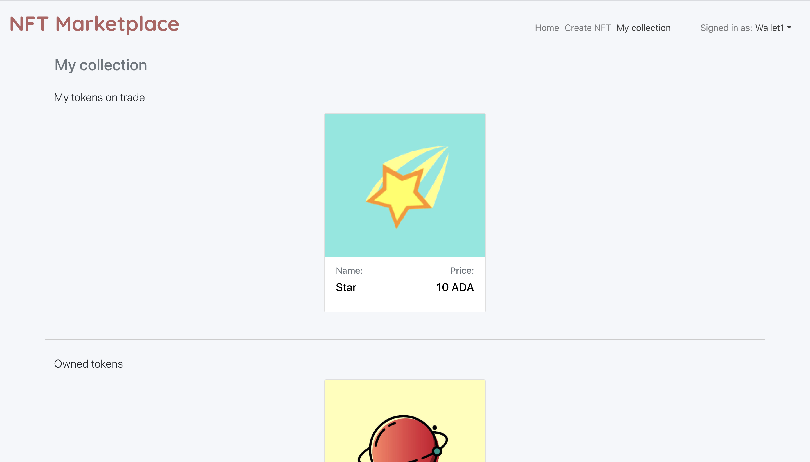

# NFT Marketplace

Frontend part of NFT-case implementation. 

## Installation

Firstly, go to the directory below.

```bash
./eleks/nft/market-web-app
```

Then run this command to install all needed for the project packages.

```bash
npm install
```

## Setting up IPFS
We can upload file to IPFS storage for storing NFT's associated file directly from the client side without server API endpoint.
For this purpose we will use free service provided by https://nft.storage

Create an account on the nft.storage service and generate an API access key.
Replace the acquired key for the IPFS_API_TOKEN constant in the file :
```bash
./eleks/nft/market-web-app/src/helpers/constants.js
```


## Run app
Run this command to run the application. The app will run on **:3000** port.

```bash 
npm start
```

## Open in browser
You need to enable cross-origin policies in the browser for local app development. For example, you can open Google Chrome with this command.

```bash 
open -n -a /Applications/Google\ Chrome.app/Contents/MacOS/Google\ Chrome --args --user-data-dir="/tmp/chrome_dev_test" --disable-web-security
```

## Set wallets
You need to set on frontend part right wallets ids.
Wallets ids can be found here:

```bash
./eleks/nft
```
Open files with these names and obtain ids.

```bash
W1.cid
W2.cid
W3.cid
W4.cid
```

The insert properly ids in file with directory:

```bash
./eleks/nft/market-web-app/src/helpers/constants.js
```
## App usage

## Login
You should login before start using the system. Just choose any of wallets.


## Create token
If you want to test the system, you should start with creating new token. It can be done in *Create NFT* tab. 


Navigate to **My collection** page to check created token. It should appear in *Owned tokens* section.

## My collection
My collection page purpose is to display both owned and your selling tokens. Thus this page has two different sections *Owned tokens* and *My tokens on trade* sections. 

For more info about certain token you can click on it. It will navigate you to token page, where you will be able to perform more actions with token.



## View single token
Here you can see more details about token, including description, autor name, price and seller. Note that seller and price is present only if token is on trade at this moment. 

Also here you will be able to perform various actions with token like buy it, transfer, sell and cancel selling. 


## Storefront
Storefront displays all tokens that are on trande right now. It also displays both your tokens on trade and tokens from other users. 

All tokens are clickable like it is on **My collection** page.


## Sell token
The way to sell token is:
Go to **My collection** page and click on any of tokens from *Owned tokens* section. Tokens from other section will have other available actions as they are already on sale. After navigating to *single token page* just push the button *Sell token* and follow instructions.

## Cancel sell token
You can also cancel sell action on token:
Go to **My collection** page and click on token from *My tokens on trade* section. After navigating to *single token page* just push the button *Cancel sell token*.

Another way is to find your token via **Storefront** page. You can click on token and if it is your token on trade you will have the same *Cancel sell* button.

## Buy token
The way to buy token is:
Go to **Storefront** page and click on the token, that you want to buy. After navigating to *single token page* just push the button *Buy token* and follow instructions.

Remember that this page contains not only others tokens, but also your tokens on sale, so you will not be able to buy them.

## Transfer token
You can also transfer your token to the other wallet without sell flow. 
Go to **My collection** page and click on token from *Owned tokens* section. After navigating to *single token page* just push the button *Transfer token* and follow instructions.

Note that you are able to transfer only your tokens, that are not on trade.


