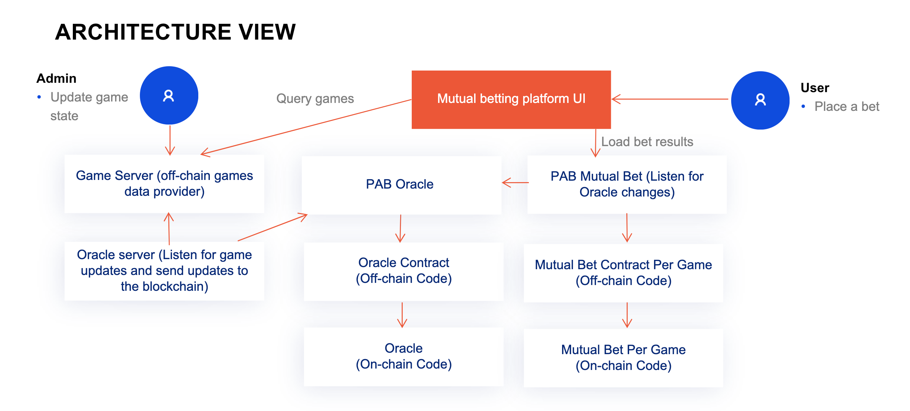
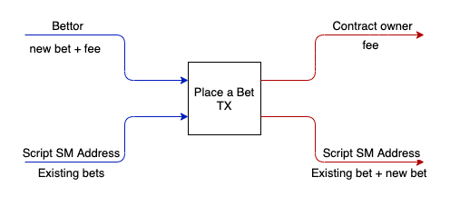
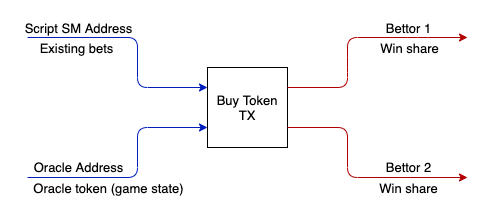
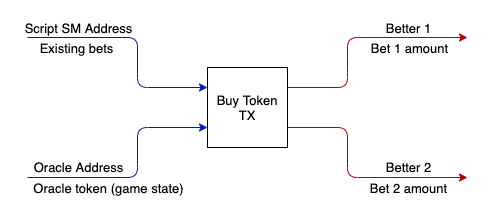

#  Oracle and Mutual Bet platform.

The main idea of this prototype is to demonstrate the possibility of the business use case for Oracle and Mutual bet platofrm, implemented with Plutus smart-contract language on the Cardano blockchain. 
On the high level, the DApp consists of the following components:​
- Off Chain game server used as source of truth for Oracle smart contract. At the moment games are mocked inside fixture-template.json. Server provides api to query available games and change game state (e.g. mark as finished). Can be connected to the online sports api
- the Plutus Application Backend - used to start all mutual bet contracts for all games and to listen for Game server updates and update oracle state accordingly. There is limitation that we can have only one PAB at a time, so one PAB used for both mutual bet platform and oracle 
- Mutual bet server - can act as facade for PAB, at the moment used to get wallet pubkey 
- Mutual bet platform UI - for bettors to make a bet on a game
- Mutual bet contract - contract to manage game bets, use oracle to manage contract lifecycle
- Oracle contract - clients can request oracle to provide data for specific game output. Each request is unqiue and belong to the one client.



## Mutual bet contract
Mutual bet contract is based on the state machine. Each game has a separate Contract with the next states:
Ongoing - Bets are open
Bets closed - Game in progress, betting is closed
Finished - Contract finished, either game completed or cancelled

### Place a bet
User can place a bet on a specific game. There is a minimum bet ammount.
User pays a fee to the contract owner.


### Payout
Payout to the winners. On the game finish winning share is taken from the lost bettors and shared proportionally to the winners participants


### Cancel/No winners
When game cancelled or completed with no winning bet all bets are returned to the bettors. Fee is retained by the contract owner.


## Core functionality 
1. SignIn ability with one of the pre defined default wallets 
2. See the avaiable games lists.
3. Make a bet for selected game.
4. See the active games bets (current user and all others).

## Technology Stack
1. Plutus
2. Plutus Application Backend (PAB)
4. ReactJS

## Possible improvements
1. Have the avility to start mutual bet contract via rest api. https://github.com/input-output-hk/plutus/issues/3972
2. Have the ability to query complete contracts to get all users previous bets. https://github.com/input-output-hk/plutus/issues/3971

## Games info rest server 

1. Build the game rest server:
```
cabal build gameserver
```
2. Run the Games server:
```
cabal exec -- gameserver
```

### game server API 

1. Games list
curl -s http://localhost:8081/games

2. Game by id 
curl -s http://localhost:8081/games/1

3. Mark game as completed
Available statuses
NS   - "Not Started",
LIVE - "In Progress", 
FT   - "Match Finished"
CANC - "Match Cancelled"

switch to live 
curl -v -X PUT -H "Content-Type: application/json" \
    -d '{"ugpSatus": "LIVE", "ugpWinnerTeamId": 0}' \
    http://localhost:8081/games/1

finish with winner
curl -v -X PUT -H "Content-Type: application/json" \
    -d '{"ugpSatus": "FT", "ugpWinnerTeamId": 55}' \
    http://localhost:8081/games/1

4. Update Match Goals
curl -v -X PUT -H "Content-Type: application/json" \
    -d '{"ugpHome": 3, "ugpAway": 1}' \
    http://localhost:8081/games/1/goals

## Mutual bet rest server 

1. Build the game rest server:
```
cabal build mutualbetserver
```
2. Run the Games server:
```
cabal exec -- mutualbetserver
```

### mutual bet server API 

1. Wallet info (WalletId, PubKey)
curl -s http://localhost:8082/wallet/1

## The Plutus Application Backend (PAB) example
We have provided an example PAB application in `./pab`. With the PAB we can serve and interact
with contracts over a web API. You can read more about the PAB here: [PAB Architecture](https://github.com/input-output-hk/plutus/blob/master/plutus-pab/ARCHITECTURE.adoc).

Here, the PAB is configured with the `Oracle` contract from `./src/Plutus/Contracts/Oracle.hs`

Here's an example of running and interacting with this contract via the API. For this it will help if you
have `jq` installed.

1. Build the PAB executable:
```
cabal build bet-pab
```

2. Run the PAB binary:
```
cabal exec -- bet-pab
```

### Pab Queries

1. Instance status
export INSTANCE_ID=...
curl -s http://localhost:9080/api/new/contract/instance/$INSTANCE_ID/status | jq

2. Get all contract ids and wallet ids
curl -s http://localhost:9080/api/contract/instances/ | jq '.[] | select(.cicDefinition.tag=="MutualBetBettorContract") | .cicDefinition, .cicContract, .cicWallet'

3. Running mutual bat contract info and instance id
export WALLET_ID=76d5e1291d51f16eb442267faccd0ab51a3b0c4a21eb6b8f72d5f0a4ca467189ac5f70a018c6df3f632b48fd8ead1b68f39a44de06f5a5de42a6a131af0f085d44becd56fa30041efea5ff2637205181837dffd03545d3db1c11e6dcbbd3415ce8f85aad41776b99eb62a797b8c5abbe82061e1634efc4c7d5ac6fff3ca94d7f
curl -s http://localhost:9080/api/contract/instances/wallet/$WALLET_ID | jq '.[] | select(.cicDefinition.tag=="MutualBetBettorContract") | .cicDefinition, .cicContract'

### Pab transactions
1. Make a bet 
export INSTANCE_ID=c2affd9b-3269-414e-9919-891150611639
curl -H "Content-Type: application/json" \
  --request POST \
  --data '{"nbpAmount":3000000, "nbpWinnerId": 55}' \
  http://localhost:9080/api/contract/instance/$INSTANCE_ID/endpoint/bet

2. Get contract state
curl -H "Content-Type: application/json" \
  --request GET \
  http://localhost:9080/api/contract/instance/$INSTANCE_ID/status | jq '.cicCurrentState.observableState'

  76d5e1291d51f16eb442267faccd0ab51a3b0c4a21eb6b8f72d5f0a4ca467189ac5f70a018c6df3f632b48fd8ead1b68f39a44de06f5a5de42a6a131af0f085d44becd56fa30041efea5ff2637205181837dffd03545d3db1c11e6dcbbd3415ce8f85aad41776b99eb62a797b8c5abbe82061e1634efc4c7d5ac6fff3ca94d7f